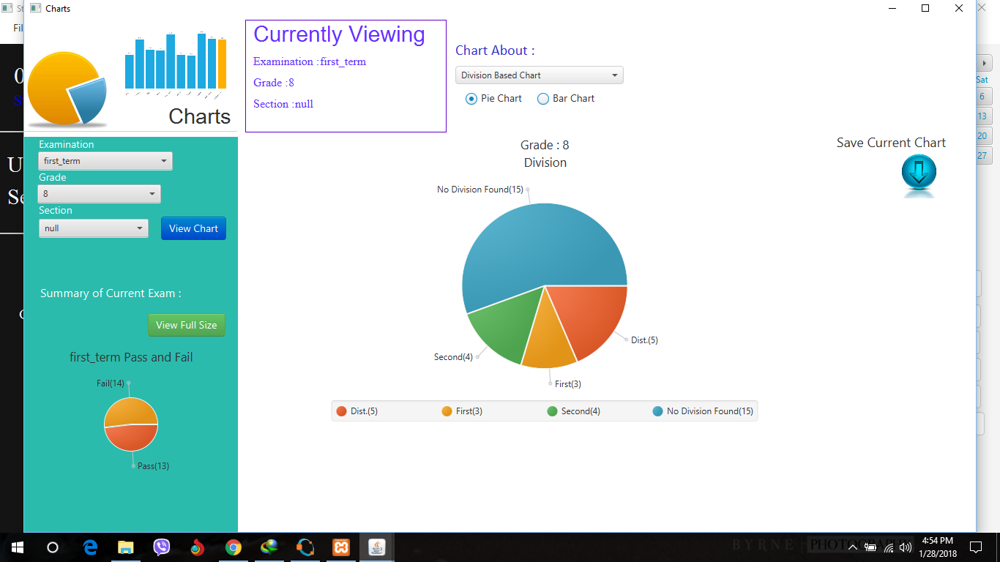
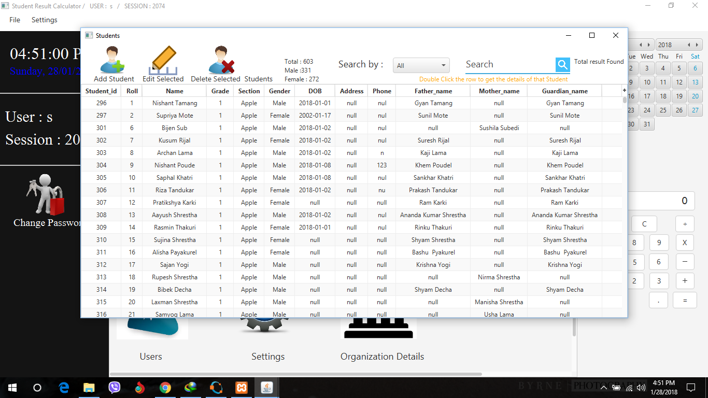
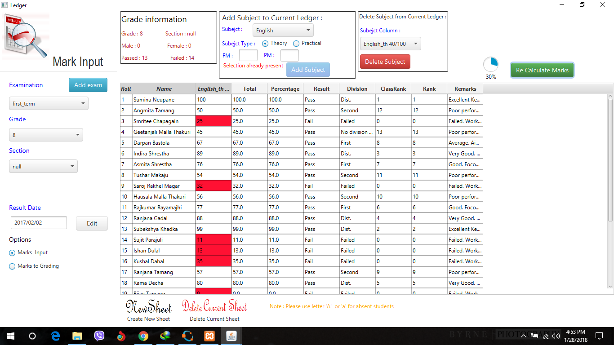
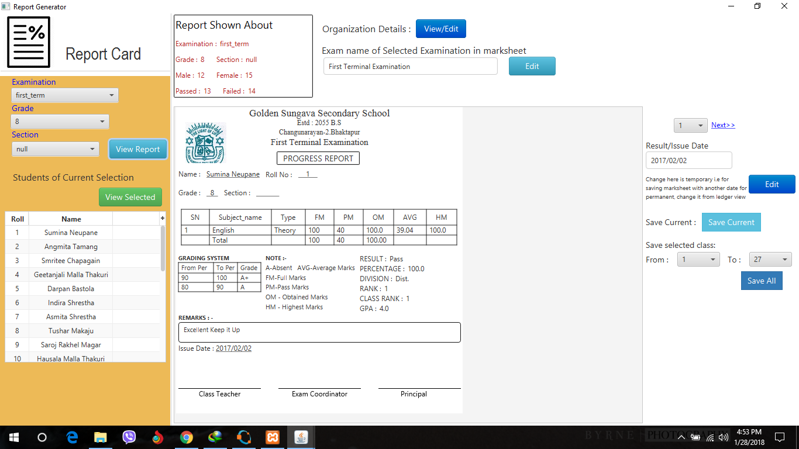

# student_result_calculator/simple student information system.(Pics below) 
# java fx project, uses fxml,mysql database
It is an application for finding the result and getting the output of the result in the marksheet, generating charts of the result. 
It can also store student ,teacher, subject, grade information here.
It can also help to assign the classes to the teachers.
We can store data for the multiple years
Two Types of users i.e admin and regular user.
# Firstly import the datbase form src/database/database to import for student result calculator.sql. Note : Database is in mysql
# install jdk 1.8 or higher, run the program
# user and password for admin,............ Username : s and Password : s, create a regular user yourself and try it. 
# NO logout system to logout one has to close the system, and again open it to re login

